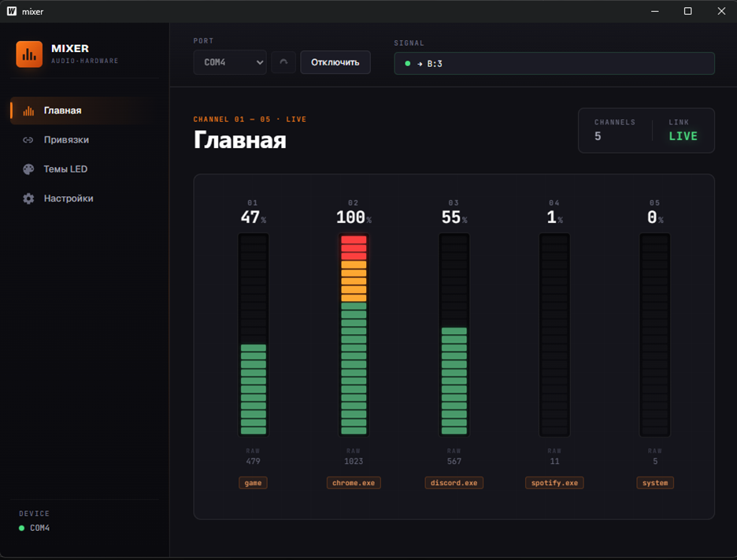
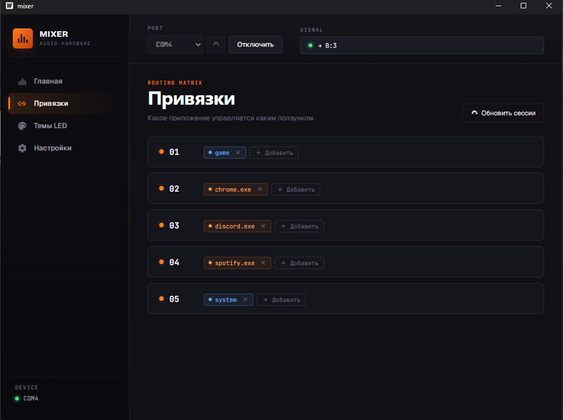
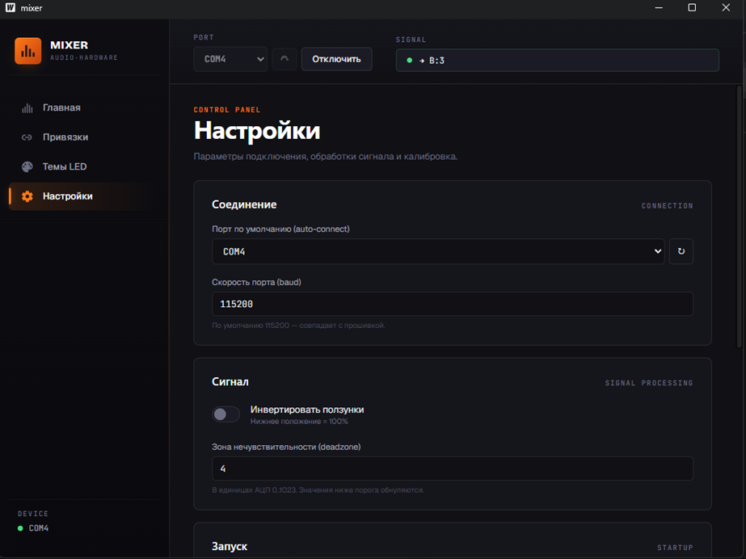
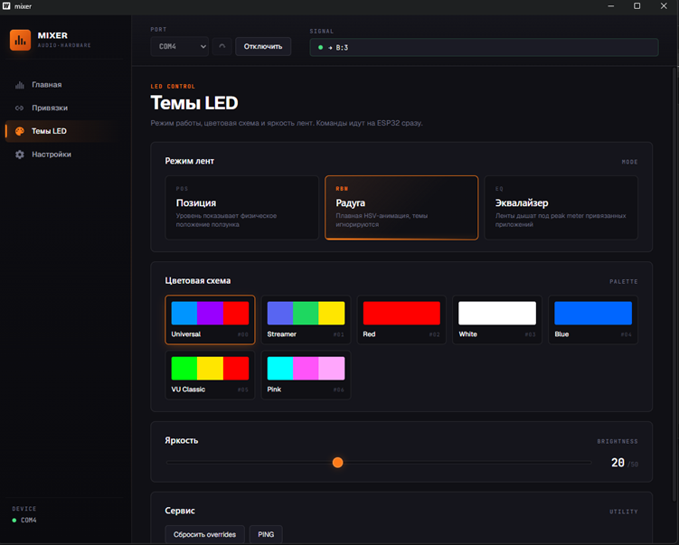

<div align="center">

# 🎚 Mixer

**Управление громкостью отдельных приложений Windows физическими ползунками**

[](https://makerworld.com/en/models/419682-volume-mixer-5-channel-deej#profileId-322350)
[](https://github.com/teslaproduuction/deej-esp32)
[](firmware/)
[](desktop/)

</div>

---

5-канальный аппаратный микшер громкости на ESP32. Каждый ползунок управляет отдельным приложением, на каждом — адресная LED-лента, отображающая уровень громкости в реальном времени.

## Интерфейс

| | |
|---|---|
|  |  |
| **Главная** — живые VU-метры 5 каналов | **Привязки** — маршрутизация приложений по ползункам |
|  |  |
| **Настройки** — соединение, обработка сигнала, калибровка | **Темы LED** — режим лент, палитра, яркость |

## Состав

```
mixer_proj/
├── firmware/   — прошивка ESP32 (PlatformIO + Arduino framework)
└── desktop/    — десктопное приложение на Go (Wails v2 + Svelte/TypeScript)
```

## Железо

- ESP32 DevKit V1
- 5 × ползунковый потенциометр 10 кОм
- 5 × WS2812B-лента (~10 LED каждая)
- Питание: USB 5V от ПК
- 3D-печатный корпус → [MakerWorld](https://makerworld.com/en/models/419682-volume-mixer-5-channel-deej#profileId-322350)

Распиновка:

| Ползунок | Аналоговый пин | LED Data |
|----------|----------------|----------|
| 1 | GPIO 32 | GPIO 25 |
| 2 | GPIO 33 | GPIO 26 |
| 3 | GPIO 34 | GPIO 27 |
| 4 | GPIO 35 | GPIO 14 |
| 5 | GPIO 36 | GPIO 13 |

ESP32 ADC2 не используется — конфликтует с Wi-Fi.

## Прошивка

```powershell
cd firmware
pio run            # сборка
pio run -t upload  # прошивка платы
pio device monitor # серийный монитор (115200 бод)
```

Зависимости PlatformIO подтянет сам (`Adafruit NeoPixel`).

### Протокол ESP32 ↔ ПК

**Uplink** (ESP32 → ПК), каждые 10 мс:
```
v1|v2|v3|v4|v5\n
```
Целые значения АЦП 0..1023 через `|`, 115200 бод.

**Downlink** (ПК → ESP32), по одной команде на строку:

| Команда | Описание |
|---------|----------|
| `T:<n>` | Установить тему (0..6) |
| `B:<n>` | Установить яркость (0..50) |
| `O:<i>,<r>,<g>,<b>` | Override цвета ползунка `i` (0..4) сплошным RGB |
| `R` | Сбросить overrides (вернуться к теме) |
| `PING` | Получить ответ `PONG` (для определения порта со стороны GUI) |

## Десктоп

Требования: Go 1.21+, Wails CLI, Node.js, Windows 10/11, драйвер Silicon Labs CP210x VCP.

```powershell
cd desktop
wails dev    # разработка (hot-reload)
wails build  # production .exe → build/bin/mixer.exe
```

Конфиг лежит в `%APPDATA%\mixer\config.yaml`, создаётся автоматически при первом запуске.

### Возможности

- Привязка ползунков к Master / отдельным приложениям (по имени exe) / системным звукам / микрофону / foreground-окну («game»)
- 4 экрана: Главная (живые бары), Привязки (drag-free редактор), Настройки, Темы LED (7 пресетов + регулировка яркости)
- Auto-unmute при поднятии ползунка выше нуля
- Калибровка АЦП (запоминает фактические min/max каждого ползунка)
- Сворачивание в системный трей с меню
- Автозапуск при входе в Windows (в трей)
- Toast-уведомления о подключении/ошибках

## Стек

| Часть | Технологии |
|-------|------------|
| Прошивка | PlatformIO, Arduino framework, Adafruit NeoPixel, EEPROM |
| Бэкенд десктопа | Go 1.21+, Wails v2, go.bug.st/serial, go-wca + go-ole (Windows Core Audio), gopkg.in/yaml.v3, energye/systray |
| Фронтенд десктопа | Svelte 4, TypeScript, Vite (всё через Wails) |

## Лицензия

MIT
